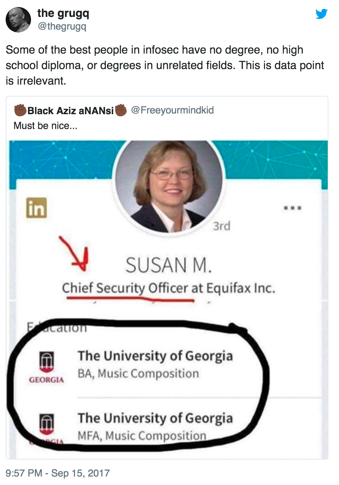
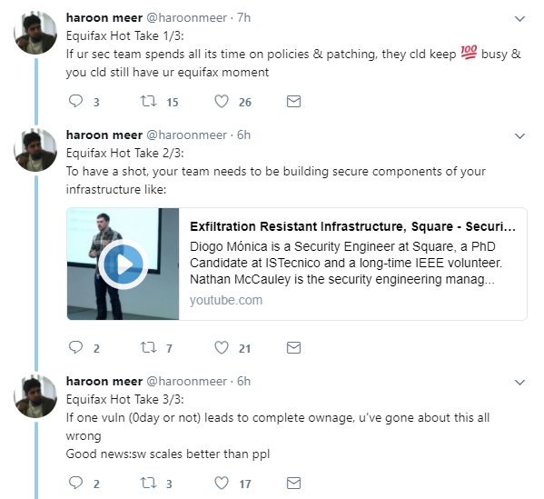
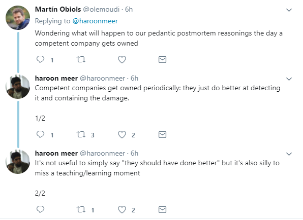

The story that keeps on giving. There's more Equifax news, including the CEO being pulled in front of Congress to testify about the breach, and both the Chief Security Officer and Chief Information Officer resigning.

There's also been a lot of noise made about the fact that the CSO's college degrees [were in music composition](http://www.marketwatch.com/story/equifax-ceo-hired-a-music-major-as-the-companys-chief-security-officer-2017-09-15) rather than anything related to IT or security. 

It's pretty clear that Equifax's security practices were bad to the point of negligence, and their hiring practices for positions like CSO are certainly relevant, but it's important to remember that in this industry people's degrees are usually less relevant than their experience. (There aren't many good degrees in infosec to begin with.)

[The grugq](https://twitter.com/thegrugq) nicely pointed out the hypocrisy, given that a good portion of the security industry is made up of 90's counter-culture hackers who typically scoff at formal education:

In other news, [Haroon Meer](https://twitter.com/haroonmeer) made some excellent posts about the Excillum breach and how property security practices are designed to limit the damage from an inevitable breach, not just prevent them from ever happening:

Haroon is the founder of Thinkst, who makes the [Canary](https://canary.tools/) line of honeypot/intrusion detection tools. It's actually quite hard to describe their tech, because "Canaries" has become the generic term for that sort of tool. 

It's well worth having a look at what they do, because they're considered best-practice in the industry for any organisation with more than a few dozen endpoints.