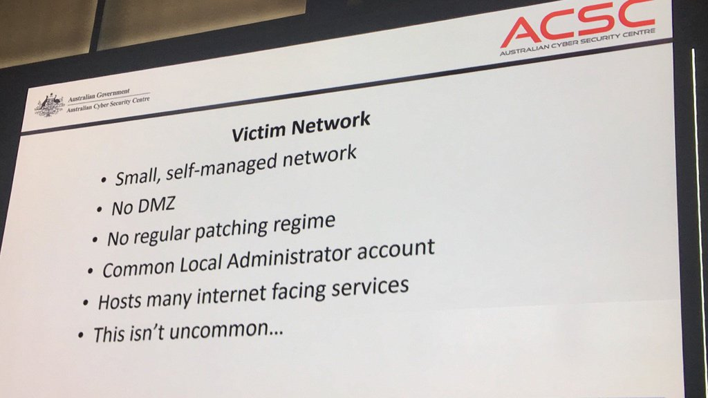
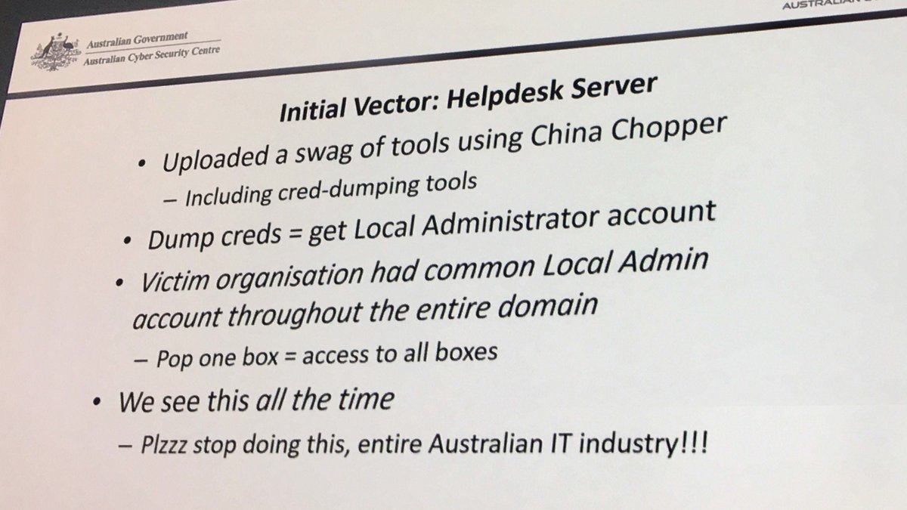

Today's catfact is an interesting story close to home (thanks to Damon and Dave for the links). Apparently a small Australian defence contractor was _**properly**_ owned back July 2016, and the attackers made off with gigs worth of data.

The reports are all sourcing a presentation by Mitchell Clarke, an incident response (IR) manager for ASD. His presentation occurred as part of the release of Australian Cyber Security Centre's annual threat report. Clarke didn't name the company, although it shouldn't be overly hard for people to guess given the published details.

What we know:
* A small Defence contractor was breached in July 2016, apparently Equifax-style (a commodity exploit on a webserver followed by webshells)
* The attacker used the webserver compromise as a beachhead to completely own the rest of the network, because internal controls were nonexistant
* It turned out that the attackers needn't have used an exploit, because there were "admin:admin" and "guest:guest" credentials in many places
* The company is about 50 employees, and only one IT person who had been in the job 9 months
* The attackers had the run of the place until November 2016 when the Incident Response people from ASD turned up
* About 30 gigs was exfiltrated in total, and it sounds like it was UNCLASS or FOUO with some ITAR in there as well

The mainstream media interest was stirred up by this article by [Stilgherrian](https://twitter.com/stilgherrian) for ZDNet:

[**Secret F-35, P-8, C-130 data stolen in Australian defence contractor hack**](http://www.zdnet.com/article/secret-f-35-p-8-c-130-data-stolen-in-australian-defence-contractor-hack/)

>The victim's network was small. One person managed all IT-related functions, and they'd only been in the role for nine months. High staff turnover was typical.
>
>There was no protective DMZ network, no regular patching regime, and a common Local Administrator account password on all servers. Hosts had many internet-facing services.
>
>Access was initially gained by exploiting a 12-month-old vulnerability in the company's IT Helpdesk Portal, which was mounting the company's file server using the Domain Administrator account. Lateral movement using those same credentials eventually gave the attacker access to the domain controller and the remote desktop server, and to email and other sensitive information.

Ouch. It's no surprise they were compromised: about their only line of defence was the webserver. Once that was popped, lateral movement through the rest of the network was trivial.

It's pretty bad, but remember that these practices are the norm for many SMEs in Australia. IT Security is still seen as a cost centre, and most executives don't understand "the cyber" enough to know where to put the money, even if they have the inclination to spend it and can find the right people. These problems are compounded for small orgs.

Mind you, defence contractors don't really get to use this as an excuse. Getting owned due to sloppy security practices holds a lot more stigma in Defence than it does in other industries, and for good reason.

The story seems to have generated a lot more media interest than would normally be expected (slow news week maybe?), and in response the Aus Government has clammed up and is refusing to comment further.

It's actually worth reading Stilgherrian's [recent Twitter posts](https://twitter.com/stilgherrian/status/917907205717770240) (he took photos of the presentation), as there's some really interesting tidbits in there. One example, a summary of the victim network:

And an example of ASD's frustration at seeing this all the time (I can relate):

Some further links, all with varying amounts of detail:
* https://www.itnews.com.au/news/defence-contractors-it-systems-breached-475047
* http://www.smh.com.au/federal-politics/political-news/hacker-codenamed-in-honour-of-alf-from-home-and-away-stole-sensitive-data-about-australian-military-projects-20171011-gyz1hb.html
* http://www.abc.net.au/news/2017-10-10/defence-contractors-files-stolen-in-hacking:-security-report/9032290?pfmredir=sm

The story even made the New York Times: https://www.nytimes.com/2017/10/10/world/australia/cybersecurity-data-breach.html