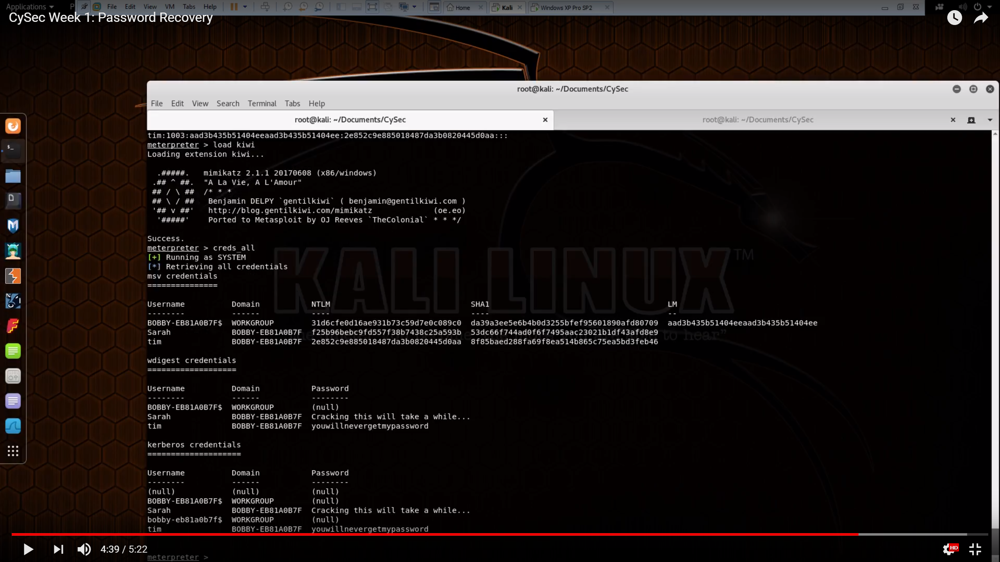

A technical catfact today: all about credential theft. 

Credential theft is a major component of most attacks, and has been for some time. The tail-end of a penetration test usually looks something like the following:
* Obtain foothold on a Windows endpoint (e.g. via spear phishing email)
* Escalate privileges to Administrator/SYSTEM
* Run [Mimikatz](https://attack.mitre.org/wiki/Technique/T1003) or a similar tool
* Using retrieved credentials, start hopping around the network dumping more creds until you find a Domain Administrator
* Brag to client about getting Domain Administrator privileges, and start writing report

Stealing credentials has also started to feature in more sophisticated malware like NotPetya, which retrieved credentials using the same methods as Mimikatz, and then used the stolen creds to propagate through the network. More recently, the hack on the [un-named Australian Defence contractor](http://www.zdnet.com/article/secret-f-35-p-8-c-130-data-stolen-in-australian-defence-contractor-hack/) involved credential theft, because the attackers landed on a webserver with a Domain Administrator already logged in (allowing their credentials to be stolen).

This sort of attack is absolutely devastating to organisations who use a shared Local Administrator password for all of their Windows endpoints, which is sadly a **lot** of organisations. This practice means that once you've compromised a single system in the network with SYSTEM privileges, you have compromised them all.

Credential theft is one of those things which is way easier to demonstrate than it is to explain in text. Conveniently, I made a demonstration video for some Adelaide Uni cyber security workshops to demonstrate how basic credential theft works. (Those of you who are already familiar with this can skip to the next subheading.)

[**Demonstration: Password Recovery**](https://www.youtube.com/watch?v=GSlvHAbzCIM)

The video isn't narrated, so some explanation is necessary:

1. There are two machines being shown: 
    * One Windows XP SP2 system with three users (two logged in), and 
    * The attacking Kali machine
2. (0:16) In Kali, we open Metasploit and load an exploit for Win XP ([MS08-067](https://blogs.technet.microsoft.com/johnla/2015/09/26/the-inside-story-behind-ms08-067/))
    * The exploit is relatively simple (to use), and only needs the target's IP address
    * There's a lot happening under the covers here, but we can ignore it for this demo
3. (0:55) The exploit is executed, giving us remote code execution (RCE) on the Win XP system
    * Our Meterpreter malware payload executes, giving us a Meterpreter session
    * We run a couple of basic commands like 'sysinfo' to prove that we're on the Win XP system and have SYSTEM privileges
    * We open a cmd.exe shell using the 'shell' command, just to demonstrate poking around the My Documents folders
4. (1:38) The actual credential theft: we run the Meterpreter command 'hashdump', which pulls out all of the hashed user passwords from the Windows LSASS process

The next few minutes demonstrate the process of performing a basic password cracking attack on the password hashes to retrieve the plaintext passwords, which you can skip over. 

5. (4:20) We use Meterpreter to load the 'kiwi' module - a version of Mimikatz
    * Running the 'creds_all' Mimikatz command dumps all of the credentials out of the LSASS process
    * This gives us the plaintext passwords for any users who are currently logged in (no cracking needed).

Note that while this demonstration used Windows XP as the 'victim' system, this was only for convenience (the MS08-067 exploit is extremely reliable). In a modern enterprise using Windows 7 it's less common to be able to steal plaintext passwords directly, but you can instead steal other credentials such as Kerberos Ticket Granting Tickets (TGTs), which can also be used for lateral movement.

In short, once you have SYSTEM privileges on any Windows endpoint, everything after point 4 above works in pretty much the same way. At least until Windows 10.

### Windows 10 and SACL Audit Events

James Forshaw from Google's Project Zero team has written a great article on some additions to Windows 10 which are designed to make this sort of credential theft harder, by raising audit events when someone tries to access the LSASS process ('hashdump' and Mimikatz both need to do this, in order to dump the credentials). 

Unfortunately, it turns out that these particular additions are fairly trivial to bypass if you have Administrator/SYSTEM privileges already - and you'd need these privileges to dump credentials in the first place.

[**Bypassing SACL Auditing on LSASS**](https://tyranidslair.blogspot.com/2017/10/bypassing-sacl-auditing-on-lsass.html)

>Of course this is just the easy way of bypassing the auditing. You could easily inject arbitrary code and threads into the process and also not hit the audit entry. This makes the audit SACL pretty useless as malicious code can easily circumvent it. As ever, if you’ve got administrator level code running on your machine you’re going to have a bad time.
>
>So what’s the takeaway from this? One thing is you probably shouldn’t rely on the configured SACL to detect malicious code trying to exploit the memory in LSASS. The SACL is very weak, and it’s trivial to circumvent. 

### Windows 10 Credential Guard

As Forshaw notes at the end of the article, one of the better alternatives to the SACL audit events (and one of the major security improvements of Windows 10) is [Credential Guard](https://docs.microsoft.com/en-us/windows/access-protection/credential-guard/credential-guard-requirements), which hides sensitive information like hashed passwords and Kerberos tickets within a virtualised environment. This makes them much harder to get to for any code running on the system, even if the attacker has Admin/SYSTEM privileges.

The best explanation of Credential Guard I've seen is [this video](https://www.youtube.com/watch?v=7mLifQiKdfk) by the author of Mimikatz, Benjamin Delpy (Slides [here](https://microsoftrnd.co.il/Press%20Kit/BlueHat%20IL%20Decks/BenjaminDelpy.pdf)). The bit regarding Credential Guard starts at 11:05/Slide 18, but the whole thing is worth watching if you have time (and can understand Delpy's French accent).

Because it relies on virtualisation, Credential Guard only works on physical Windows 10 systems - i.e. it won't work on a Windows 10 virtual machine. It also requires the Enterprise Edition of Windows 10, and isn't enabled by default as it breaks a lot of legacy authentication mechanisms. 

Even with all these caveats, it's a big step in the right direction. Once Windows 10 is the norm in enterprises, and Credential Guard is used more widely, using credential theft for lateral movement will become a lot harder for attackers.