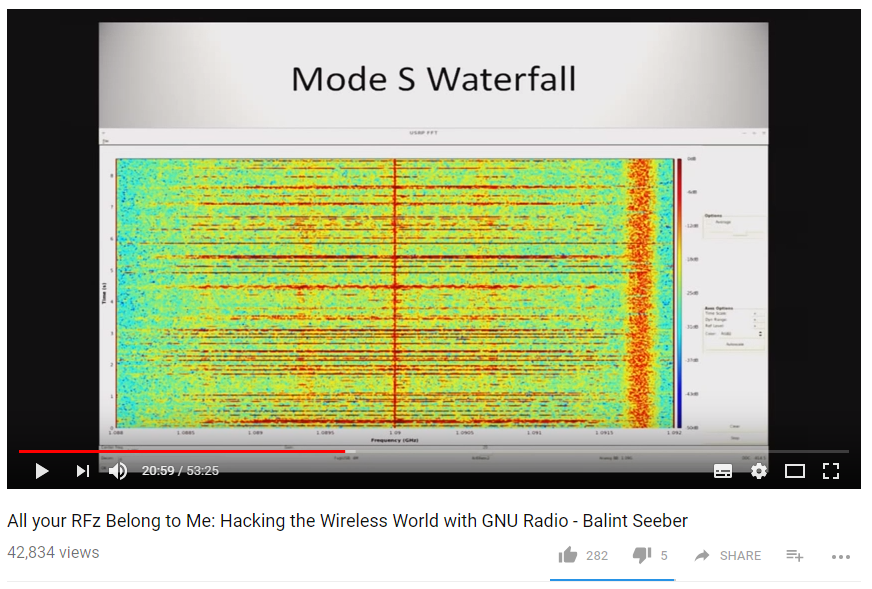

Today's topic is near and dear to me (and some of you): Software Defined Radio!

SDR has been a growing part of the security industry for a while now, but attacks using SDR are still relatively niche. The equipment needed to perform them has never been more [accessible](https://hakshop.com/products/hackrf), but using it effectively is a lot more difficult than using something like Metasploit.

On to the article:

[**Boeing 757 Testing Shows Airplanes Vulnerable to Hacking, DHS Says**](http://www.aviationtoday.com/2017/11/08/boeing-757-testing-shows-airplanes-vulnerable-hacking-dhs-says/)

>A team of government, industry and academic officials successfully demonstrated that a commercial aircraft could be remotely hacked in a non-laboratory setting last year, a U.S. Department of Homeland Security (DHS) official said Wednesday at the 2017 CyberSat Summit in Tysons Corner, Virginia.
>
>“We got the airplane on Sept. 19, 2016. Two days later, I was successful in accomplishing a remote, non-cooperative, penetration,” said Robert Hickey, aviation program manager within the Cyber Security Division of the DHS Science and Technology (S&T) Directorate.
>
>“[Which] means I didn’t have anybody touching the airplane, I didn’t have an insider threat. I stood off using typical stuff that could get through security and we were able to establish a presence on the systems of the aircraft.” Hickey said the details of the hack and the work his team are doing are classified, but said they accessed the aircraft’s systems through radio frequency communications, adding that, based on the RF configuration of most aircraft, “you can come to grips pretty quickly where we went” on the aircraft.

To be frank, this is slightly overselling it. The attack probably involved [spoofing false data](https://en.wikipedia.org/wiki/Spoofing_attack) using GPS, Mode S positional radar, or the ACARS messaging system: for example, making it look like the aircraft was in a different position, that there was another aircraft on a collision course, or sending messages to the cockpit.

This is still a problem, but it's a bit of a stretch to call it "hacking". No one is going to be [popping shells](https://i.imgur.com/vRU0Fum.gif) on a Boeing aircraft using these techniques.

As Jake Williams put it on [Twitter](https://twitter.com/MalwareJake/status/929021262088884224):

>Let's be clear what's happening here. They're sending positional data to aircraft using SDR, NOT controlling it.

As I said, it might not be sexy Hollywood Hacking, but this is still a serious problem: pilots tend to assume that these systems are giving them accurate information, despite the fact that the underlying technology was never designed for that level of assurance.

Australia's own [Balint Seeber](https://twitter.com/spenchdotnet) has been presenting on this topic since 2011, and worked for Ettus Research (makers of the [USRP](https://www.ettus.com/product/category/USRP-X-Series) software defined radio platform) for three years until 2015. His presentation at Ruxcon 2011 is well worth a watch:

[**All your RFz Belong to Me: Hacking the Wireless World with GNU Radio**]()

During the presentation he discusses just how easy it is to mess with the radio systems on modern aircraft, because they were never designed with security in mind, and it was assumed that the specialised radio equipment need to spoof or jam these signals would make it prohibitive for anyone non-military to bother.

Obviously that was a false assumption given the pace of technology, but keep in mind that these standards are decades old, so you can't really blame them for not predicting modern SDR tools.

In any case, aircraft radios aren't alone here. Balint also gives some examples of healthcare systems which suffer from the same vulnerabilities. All non-military radio systems tend to be vulnerable to these sorts of attacks, particularly [jamming](https://en.wikipedia.org/wiki/Radio_jamming).

In the consumer sphere, this is a perfectly acceptable decision: for consumer-grade systems, protecting against jamming is one of those security trade-offs which just isn't worth the sacrifices you'd need to make.

Of course, my mobile phone reception is slightly less important than a commercial aircraft radio system, so there's a grey area here. These systems might not warrant mil-spec jamming resistance, but if someone starts spoofing signals, we're going to have a bad time.