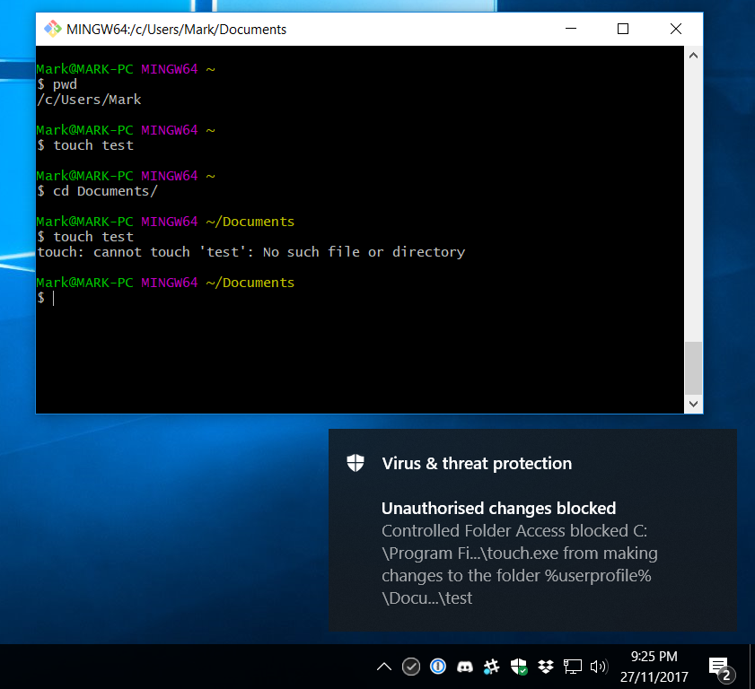
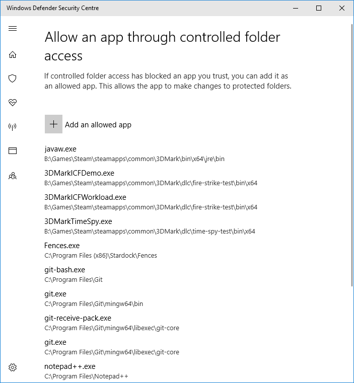

I've recently finished building a new gaming PC and going through the usual hassles that come with a fresh Windows install. 

In this case I added a new hassle: I've decided to start using the Controlled Folder Access feature which was recently rolled out in the Windows 10 Fall Creator's Update.

The Register has a good summary (and very British heading):

[**Please activate the anti-ransomware protection in your Windows 10 Fall Creators Update PC. Ta**](https://www.theregister.co.uk/2017/10/23/fyi_windows_10_ransomware_protection/)

>A below-the-radar security feature in the Windows 10 Fall Creators Update, aka version 1709 released last week, can stop ransomware and other file-scrambling nasties dead.
>
>The controlled folder access mechanism within Windows Defender prevents suspicious applications from changing the contents of selected protected folders.
>
>Though controlled folder access has been known about for months – it surfaced with Insider builds earlier this summer – the feature is only now being thrust into the spotlight with the general public release of the Fall Creators Update for Windows 10.
>
>The feature can be enabled through the Windows Defender Security Center App for most users, and is accessed by opening the virus & threat protection screen within Defender. From there, users switch on the controlled folder access option to activate controlled folders.

The idea is that any 'untrusted' application is blocked from writing to the normal user directories (Documents, Pictures, etc), which is exactly what ransomware needs to do when it executes. With Controlled Folder Access enabled, any application wanting to write to these directories needs to be explicitly approved (whitelisted) by the user.

It's a great feature and a step in the right direction, but I can see why Microsoft didn't make it the default: the usability still needs a lot of work.

For some background: most traditional Windows apps assume that they can write to any user-controlled folder and scribble all over your files without any problems, in the same way that pre-Vista applications assumed they'd always be running with Administrator privileges. 

That's not to say that these apps are malicious, it's just that developers don't always prioritise good security practices and the Principle of Least Privilege when they're desperately trying to ship an app on time.

On a related note, this is the same reason that PC games still write their saved games to "My Documents", despite the "Saved Games" folder being added way back in Windows 7 for exactly this purpose. 

I'll let Slightly Snarky Wikipedia Editor [summarise the issue](https://en.wikipedia.org/wiki/My_Documents):

>**My Documents** is the commonly recognized name of a special folder in Microsoft Windows (even though starting with Windows Vista, it is called **Documents** only, and the actual name of the folder might be different when the language of the installed copy of Windows is not English.) This folder is supposed to be a personal area where users store their personal non-shared documents. However, many software developers have ignored this convention and as a result, this folder has become a dumping ground for the application data such as files containing settings and saved games. Users cannot delete, move or organize these files without causing unwanted behavior in their software.

The point is that apps on Windows tend to assume that they can write to these folders, and they run into issues when Controlled Folder Access stops them from doing so. The results can be confusing:

For those of you who aren't familiar with *nix, that's me running the `touch` command to create a file called 'test'. It succeeds in `C:\Users\Mark`, but fails in `C:\Users\Mark\Documents`. That's very confusing as a user, and the error message in the terminal window makes little sense - how can I get a "no such file or directory" error for a file I'm creating?

Fortunately, Windows Defender **does** provide a notification explaining that it blocked the executable. If I click on that notification, I end up at the control panel allowing me to 'allow' (or whitelist) particular applications:

(As you can see, I've been to this page a few times by now.)

I now have the ability to add the application to the allowed list, but the notification in the first screenshot is the only information I was given about what was blocked - and because the path to the blocked executable was truncated in the notification text, I can't actually find it unless I already know where to look.

The single biggest problem with Control Folder Access is in this process: from an application being blocked, through to successfully whitelisting it. 

For this feature to be accepted, the whitelisting process needs to be easy enough so that users can approve a legitimate application without undue hassle, but **not** so easy that the whitelisting process itself can be trivially bypassed with social engineering. 

For example, imagine the following email:

>Hi, latest presentation attached. You'll need to enable macros for the videos to work, and you'll get a warning saying something like "unauthorised changes blocked" - just click "approve application" and it should work. Sorry, I don't know why it keeps doing that.

For what it's worth, this balance is the hardest part to get right in any application whitelisting solution, so Microsoft isn't alone here.

Note that there is a workaround for the truncated path issue with Controlled Folder Access: if you use the Windows Event Viewer, download the [Exploit Guard Evaluation Package](https://docs.microsoft.com/en-us/windows/threat-protection/windows-defender-exploit-guard/audit-windows-defender-exploit-guard) from Microsoft, and install a custom event filter, you can see each event for blocked applications in full, including the full path to the blocked .exe. 

Of course, most sane people will have stopped reading at "Windows Event Viewer", because this is a ridiculous workaround. To be fair, Controlled Folder Access isn't on by default for exactly this reason - it's not ready for regular users. It's still an excellent step in the right direction for preventing common ransomware attacks.

As always, there's a trade-off between security and productivity. The trick is getting the balance right.