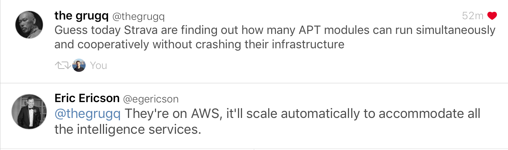

Some quick follow up on yesterday's email: the Strava fitness tracker story has been making headlines, although some of the headlines are quite dumb:

To be clear, if your "secret army base" is visible on a satellite view, it's not secret.

The real benefit of the Strava data is that it makes correlations far easier than they used to be, and the data being 'anonymized', doesn't mean all that much when you can follow an individual track from the NSA carpark to their home address. I might not know who the track represents, but if I look up who lives at that house, it's not going to be hard to guess. As I mentioned in an email late last year: it's almost impossible to anonymise data effectively if it's published down to the individual level.

Jake Williams made a [series](https://twitter.com/MalwareJake/status/957757109071904770) of [good](https://twitter.com/MalwareJake/status/957758174173462529) [tweets](https://twitter.com/MalwareJake/status/957759434486370305) noting how useful this data would be for nation states: Strava has a "privacy zone" feature which allows uses to designate certain geographical areas where their trip won't be recorded if it starts or ends within that area. It's not hard to imagine that there would be some pretty sensitive stuff in this dataset.

Also, as the grugq aptly points out below, this makes Strava themselves a massive target for any nation state who didn't already have this data. After all, the dataset probably isn't anonymized until it hits the heatmap, so if you pulled it from the source directly you'd likely have usernames, emails, and other personal information to go along with your GPS coordinates.

Zing.