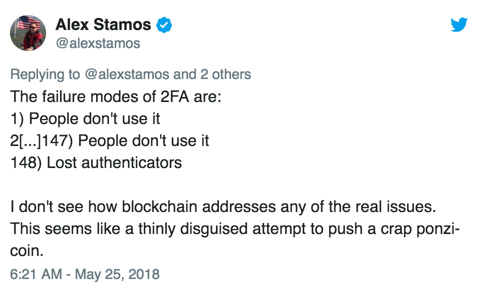

Good morning.

There's a lot of news this week, including quite a bit relating to Australia, but today I'm taking a page out of the modern journalism playbook and just writing about Twitter posts. Sorry not sorry.

### Traditional org charts, and technical specialists vs managers

I went on a bit of a [rant on Twitter](https://twitter.com/markeldo/status/999132305405956096) a few nights ago, after  I woke up at 4am and the sun was already up. (Sweden problems.)

The topic of discussion was something which has bothered me for a long time: the fact that in too many organisations, higher pay means management:

>Management and technical roles require very different skills, and sometimes you might have to pay your specialists more than their managers. That’s not easy to do in a traditional org chart, at least not without putting lots of noses out of joint.

The root of the problem is that technical specialisations and management are two entirely orthogonal skillsets, and promoting from one to the other only makes sense for the small proportion of workers who happen to be excellent at both. However, in a traditional organisational hierarchy, moving into management is the only way to get a pay rise.

It doesn't help that management as an actual skill has been [historically under-appreciated](http://www.businessinsider.com/larry-page-the-untold-story-2014-4?r=US&IR=T&IR=T) in many tech companies. Techies have a habit of underestimating how difficult or important other fields actually are, likely because so much of tech is self-taught: *"I can learn Ruby in a week, how hard can management be?"*

Academia suffers from a similar problem: the skillset for research is completely unrelated to the skillset required to be a good teacher. However, KPI's for an academic revolve around research output (journal acceptance, number of citations, etc), and the teaching component is secondary. Being a good teacher is valued, but it's not incentivised. 

### The *"we need a network engineer with a security clearance"* problem

This issue leads to significant problems in organisations where salary bands are highly structured and mapped to explicit position descriptions (quite common in [government organisations](http://www.apsc.gov.au/publications-and-media/current-publications/worklevel-standards/el1)). In this sort of model, earning over a certain amount—the *management threshold*—often means managing a team of employees, and little if any technical work. 

This causes all sorts of issues when the *management threshold* is lower than the market rate for the specialists you need to keep the lights on. If you offer them market rate, they're forced into management, and can no longer do the job they were hired to do. If you don't offer them market rate, well... [the results are predictable](https://imgur.com/gallery/JmNORei). 

Alternatively, you can pay market rate and put the specialist above the management threshold, but then you run the risk of outsiders asking pointed questions: *"but they don't have any direct reports! How can they justify that salary?"*

In practice, these pointed questions are usually avoided by [hiring the specialist as a consultant](https://www.smh.com.au/politics/federal/there-s-a-lack-of-transparency-on-executive-pay-and-contractors-in-aps-20180530-p4zidt.html) and skipping the salary bands entirely. This is (or used to be) easier to justify in Senate Estimates.

A better solution (used by [Google](https://www.quora.com/What-are-all-the-job-levels-in-Googles-technical-career-track) and [Microsoft](https://www.quora.com/What-are-all-the-job-levels-in-Microsofts-technical-career-track), and many others) is to have separate "tracks" for technical specialists vs management, which makes the whole problem much more manageable (pun intended). 

Splitting the two is a much better approach, and it's something many Australian companies and government departments could learn from.

### Don't try to pitch blockchain to Alex Stamos via Twitter

On a lighter note, [this exchange](https://twitter.com/alexstamos/status/999769878071406592) was absolutely priceless. Alex Stamos is Facebook's Chief Security Officer, and a very smart guy.

To briefly summarise:
* The "DigiByte" cryptocurrency account hijacked a Twitter thread and tried to pitch Stamos on their 'Digi-ID' authentication solution, which seems to be *["authentication... but on the blockchain"](https://imgur.com/a/ceP8tK1)*.
* Stamos responds that their proposed solution doesn't solve any problem Facebook is actually concerned with, and finishes with **"Nobody should use Digi-ID."**
* Stamos proceeds to go on a rampage.

It was beautiful, really.
