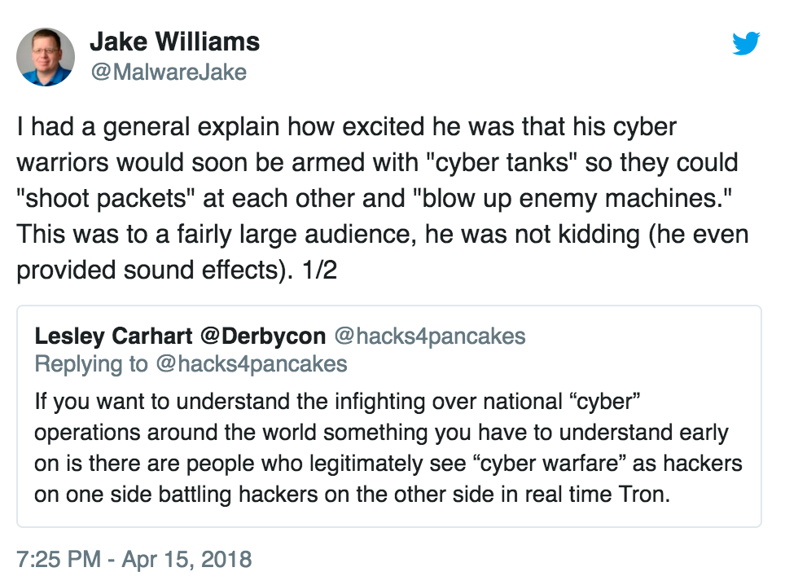

Good morning. 

There's a lot of news to get through, but I wanted to briefly recommend a podcast: 

[**The Secure Developer #16: Security Training with Elevate’s Masha Sedova**](https://overcast.fm/+IbbQBSlDw)

I've mentioned The Secure Developer podcast before, but this one is my favourite so far. it's with [Masha Sedova](https://twitter.com/modmasha) of Elevate Security.

During the podcast Masha speaks at length about the challenge of getting employees to care about security in a way which actually improves not only the security of an organisation, but also the retention of those employees. It's a great podcast (and now I want to work for Elevate).

Onto the news:

### Crypto-wars 2, Australia edition

A lot has already been said about the [various attempts](https://en.wikipedia.org/wiki/Crypto_Wars) by governments to clamp down on modern encryption techniques (the so-called "going dark" problem), and I won't try to summarise it all here.

The issue flared up in Australia this week after news broke of [new legislation](https://www.theguardian.com/technology/2018/jun/06/planned-laws-to-force-tech-firms-to-reveal-encrypted-data) compelling technology companies to allow access to encrypted data, and a [speech](https://www.zdnet.com/article/australian-government-committed-to-no-backdoors-taylor/) by Australia's minister for Law Enforcement and Cyber Security. 

On a recent episode of Late Night Live, host Phillip Adams had an excellent interview on the topic with Bruce Schneier: 

[**Late Night Live: The new encryption bill**](https://overcast.fm/+CYzEH-Mo)

Schneier is one of a handful of people in the world who can genuinely call themselves experts in cryptography. (His [Applied Cryptography](https://www.schneier.com/books/applied_cryptography/) is considered a seminal work in the field). The interview is short, and well worth listening to.

### Australian recruitment company hacked

Melbourne-based PageUp People has had a bad week:

[**Telstra, Coles, Auspost and more pull PageUp-powered job sites:**](https://www.itnews.com.au/news/telstra-coles-auspost-and-more-pull-pageup-powered-job-sites-492910)

>Major Australian firms including Coles, Telstra, AusPost and Medibank have pulled their recruitment websites offline after the service provider supplying the technology for them said it may have been breached.
>
>[iTnews first reported](https://www.itnews.com.au/news/pageup-people-hit-by-malware-infection-492863) that Melbourne-based cloud recruitment software provider, PageUp People, had experienced a malware infection that allowed an unknown party to gain unauthorised entry to some of its systems.
>
>The disclosure has forced a number of large corporates and government agencies that rely on PageUp People to suspend recruitment while they await answers on what, if anything, was compromised.

There hasn't been a lot of detail about what data was compromised, but PageUp is recommending ("out of an abundance of caution") that all clients and candidates change their passwords.

The good news is that their passwords were stored using bcrypt, which is good practice for password hashing (remember: [the choice of hashing function is important](https://markeldo.com/Email-update-Taringa-owned-and-why-password-hashing-is-important/)).

### Defence "cyber-worthiness" ratings

Another one from iTnews:

[**Defence begins 'cyber-worthiness' ratings for equipment and systems:**](https://www.itnews.com.au/news/defence-begins-cyber-worthiness-ratings-492102)

>Australia’s nascent cyber warfare unit has been tasked with rating the “cyber-worthiness” of military equipment and systems before they are used in operations.
>
>Vice Admiral Ray Griggs told a senate estimates hearing last night that cyber-worthiness ratings were being assessed by the joint information warfare unit set up in July last year.
>
>“One of the things the team is working on is the notion of cyber worthiness,” Griggs said.
>
>“It’s not the same as sea- and air-worthiness but a similar notion so that when we provide forces [with] units to an operational theatre, they are seaworthy or airworthy and also cyberworthy, which is an increasingly big body of work for [the information warfare unit] team.”

To be frank, my reaction to this one was about equal-parts approval and eyeroll. To be clear, it's absolutely a good thing that Defence is taking procurement of systems seriously from an information security perspective

However, some of these statements on "cyber-whatever" have a tendency to... well, I'll let Jake Williams [provide an example](https://twitter.com/MalwareJake/status/985569769846865922):

He goes on to elaborate:

>This is not an anomaly. Sure, there are cyber smart officers in the military. But by and large, the people making decisions about the direction of military cyber are trying to figure out how it relates to what they know: e.g. air power, artillery, or naval warfare.
>
>Of course the real problem is that cyber is it's own domain. You don't "amass forces" or "gain air superiority." We can't really move ahead until:
>1. Senior leadership doesn't think cyber is a video game
>2. They stop applying traditional warfare principles to cyber

Yep. Analogies can be helpful, but as with many other aspects of technology, we have to be careful not to tie ourselves in knots trying to see the present through the lens of the past.

As Troy Hunt put it in an excellent blog post: ["IRL Analogies Explaining Digital Concepts are Terrible"](https://www.troyhunt.com/irl-analogies-to-explain-digital-concepts-are-terrible/). It's difficult to explain technical concepts without resorting to analogies, but we need to do better.