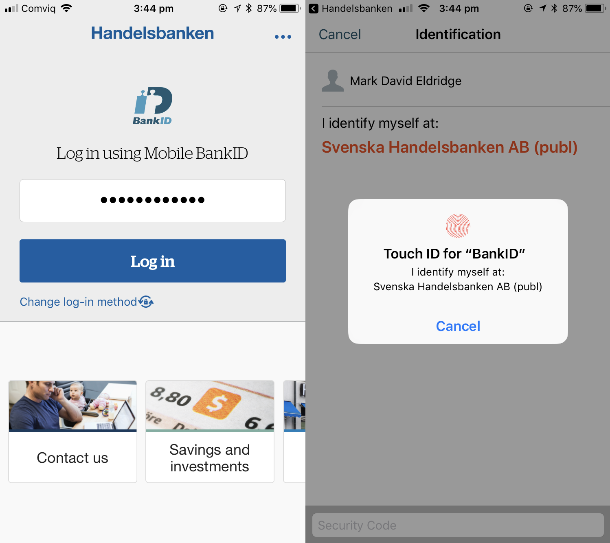

# Web Authentication, BankID, and the death of passwords

In my [last email](/Email-update-Tweetstorms-Technical-vs-management-and-blockchain-authentication/) I mentioned Alex Stamos' [Twitter takedown](https://twitter.com/alexstamos/status/999769878071406592) of the 'Digi-ID' authentication solution. Buried in the exchange was a mention by Stamos of the *Web Authentication* standard, which is something you'll be hearing a lot more about in coming months. 

Web Authentication (or WebAuthn) is a method for using trusted devices such as smartphones or hardware tokens to authenticate users. It's an excellent piece of work, and makes it realistically possible to get rid of passwords entirely.

Duo Security has an excellent explanation of the standard (which just so happens to use the example website "*cat-facts.com*"):

[**Web Authentication: What It Is and What It Means for Passwords**](https://duo.com/blog/web-authentication-what-it-is-and-what-it-means-for-passwords)

>There are more than a few different cases for how WebAuthn would work in practice, but the most common example is this: A user visits a website, let’s say cat-facts.com, on their laptop and goes to register an account. After pressing a button to begin registration on the site, they receive a prompt on their phone saying “Register with cat-facts.com.”
>
>Once they’ve accepted the request, the user would be asked to perform an “authorization gesture,” such as typing in a PIN or biometric action that is associated with the account they are creating. After providing this, the website on the laptop would display something to the effect of “Registration complete!”
>
>The user can now log in to cat-facts.com using the same phone and authorization gesture.

For my Swedish readers: if this sounds remarkably similar to [BankID](https://www.bankid.com/en/), that's because it is. There are plenty of differences in terms of implementation, but the experience for the user is effectively the same.

## What is BankID?

For the non-Swedes: BankID is a system used to identify people in the Swedish population register (_folkbokföringsregister_), using their personal identity number ([_personnummer_](https://en.wikipedia.org/wiki/Personal_identity_number_(Sweden))). 

From the official [BankID website](https://www.bankid.com/en/om-bankid/detta-ar-bankid):

>BankID is the leading electronic identification in Sweden. BankID has been developed by a number of large banks for use by members of the public, authorities and companies. [...]
>
>BankID have 7,5 million active users. Many services are provided where citizens can use their BankID for digital identification as well as signing transactions and documents. The services vary from online and mobile banking, e-trade to tax declaration and are provided by government, municipality, banks and companies. BankID is used both for identification as well as signing. According to Swedish law, and within the European Union, BankID is an advanced signature and a signature made with a BankID is legally binding.

BankID is used to authenticate with all sorts of services in Sweden: from banks and government departments through to  gym memberships and online merchants.

The usual process for to authenticate a user is:
1. User enters their _personnummer_ into the website
2. The website requests identification via the BankID service
3. The user opens the Mobile BankID app on their phone and 'identifies' themselves (using a fingerprint or PIN code)
4. The website receives confirmation that the user has been successfully identified
5. The user is authenticated with the service

Below is an example of what this looks like. The image on the left is the login screen for the Handelsbanken mobile app. After entering your personnummer, you're redirected to the Mobile BankID app to verify your identity. Once you've verified (either with a fingerprint or a PIN code), you're sent back to the Handelsbanken app.

This process is so convenient that for most of the services you'll encounter in Sweden, there is no username and password. You login to services using your personnummer, and you authenticate using Mobile BankID on your phone.

It works remarkably well, and means that many online services in Sweden have never had to worry about the usual issues associated with user authentication: [storing passwords securely](https://www.owasp.org/index.php/Password_Storage_Cheat_Sheet), [password resets](https://www.troyhunt.com/everything-you-ever-wanted-to-know/), and [protection against credential stuffing](https://www.owasp.org/index.php/Credential_Stuffing_Prevention_Cheat_Sheet). BankID handles most of this for them.

One of the major disadvantages is the reliance on the Swedish personal number: if you're not eligible for one, or you haven't received it yet, you simply can't use BankID, and by extension, any service which uses it to authenticate users. For a foreigner living in Sweden, [this is exactly as frustrating as it sounds](https://www.thelocal.se/20171120/the-local-readers-reveal-their-personal-number-pains-in-sweden).

(Many companies in Sweden even go so far as to key their internal user databases based on the user's _personnummer_. If you don't have one, they can't add you to their system. It's not uncommon for foreign workers to arrive in Sweden and find out that their employer can't pay them until they have a personnummer, because the payroll system requires one.)

Overall, BankID is an extremely useful way to authenticate users, and life without passwords can be very nice indeed. 

Web Authentication is designed to be independent of government-issued identifiers, which means it won't have the same limitations as BankID, but this comes with a trade-off: the service will still need outside help if they want assurance of a user's real-life identity.

## The Death of Passwords

More than any other advance we've seen in the last few decades of tech, the Web Authentication standard has the potential to do away with passwords entirely - or at least for most web-based services. 

Not quite yet though. From the [Duo article](https://duo.com/blog/web-authentication-what-it-is-and-what-it-means-for-passwords):

>Don’t start deleting your passwords yet, because WebAuthn still needs a bit of work. While it looks like the WebAuthn API should be available on Firefox and Chrome in the coming months, I don’t think we’ll see it replace passwords very soon. I do hope developers and companies start to implement it as a replacement for existing two-factor authentication code they may have in their site, because when phones begin to support WebAuthn requests, it should be quick to switch over support for user verification.

In the short term, this means that two-factor authentication for websites might move away from the ubiquitous [TOTP codes](https://help.github.com/articles/configuring-two-factor-authentication-via-a-totp-mobile-app/) and towards the WebAuthn API, which will work a lot like [Duo Push](https://www.youtube.com/watch?v=tPLxe9HUDjY).

In the long term, we will be able to ditch passwords entirely and use our phones or [our keys](https://www.yubico.com/product/security-key-by-yubico/) to log into services. Once this happens, the days of being able to hijack dozens of corporate accounts using [password spraying](https://www.ncsc.gov.uk/blog-post/spray-you-spray-me-defending-against-password-spraying-attacks) with *"Password123!"* or *"Summer2018"* will be a thing of the past.

That's something everyone in security can get behind.
